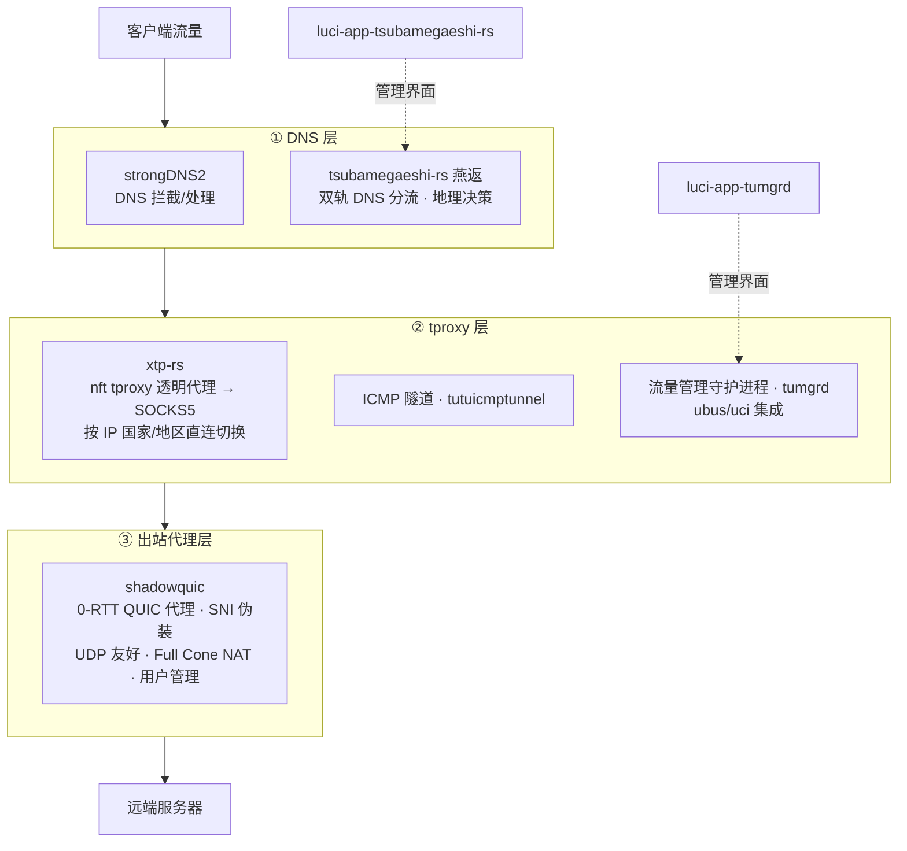

# openwrt-tutu-all-in-1

**从 DNS 到 tproxy 到 shadowquic 的一键式编译 pkg 方案。**

一条命令完成 OpenWrt 定制包的全链路构建：自动克隆各组件仓库 → 更新/安装 feeds → 按依赖顺序编译 DNS、tproxy、出站代理三层全部 pkg → 自动定位生成的 `.ipk` / `.apk` 安装包。

## 整体架构：DNS → tproxy → shadowquic

本方案把整条透明代理链路拆成三层，每层由对应的定制包承担，`build.sh` 按层依赖顺序依次编译：



| 层级 | 包名 | 作用 |
| --- | --- | --- |
| ① DNS | strongDNS2 | DNS 拦截与处理（基于 libnetfilter-queue） |
| ① DNS | tsubamegaeshi-rs（燕返） | 轻量级双轨 DNS 分流器：IP 地理决策、缓存、Xray 集成 |
| ② tproxy | xtp-rs | nft tproxy 透明代理 / 端口转发 → SOCKS5，支持按 IP 国家/地区直连切换 |
| ② tproxy | tutuicmptunnel | ICMP 隧道内核模块（kmod） |
| ② tproxy | tumgrd | 流量管理守护进程，ubus/uci 集成 |
| ③ 出站代理 | shadowquic | 0-RTT QUIC 代理，SNI 伪装、Full Cone NAT、用户管理 |

## 功能特性

- **一键全链路**：一条命令从零编译 DNS、tproxy、出站代理三层全部定制包
- **自动克隆**：将全部定制包仓库克隆到 `package/` 目录，已存在的仓库自动跳过
- **feeds 加速**：自动将 `feeds.conf.default` 中的 `git.openwrt.org` 源替换为 GitHub 镜像（国内加速/防屏蔽）
- **按需安装**：`feeds update -a -f` + 按目标包安装递归依赖
- **无需 menuconfig**：全程非交互，所有包直接按包名编译
- **依赖顺序编译**：基础依赖（sqlite3/ubus/ubox）→ DNS 层 → tproxy 层 → 出站代理层 → LuCI 应用
- **产物定位**：构建完成后自动查找生成的 `.ipk` / `.apk` 文件

## 快速开始

在 OpenWrt 源码根目录执行（该目录需包含 `scripts/feeds`）：

```bash
curl -fsSL https://raw.githubusercontent.com/hrimfaxi/openwrt-tutu-all-in-1/master/install.sh | sh

# 或自定义 make 参数（编译日志调试）
curl -fsSL https://raw.githubusercontent.com/hrimfaxi/openwrt-tutu-all-in-1/master/install.sh | sh -s V=s -j$(nproc) IGNORE_ERRORS=1
```

脚本流程：

1. 解析并保存 make 参数（如 `V=s`、`-j$(nproc)`）
2. 检查是否在 OpenWrt 源码根目录
3. 克隆全部定制包仓库到 `package/`
4. 更新并安装 feeds 依赖
5. 按依赖顺序编译各层包：基础依赖 → DNS 层 → tproxy 层 → shadowquic → LuCI 应用
6. 查找并列出生成的 `.ipk` / `.apk` 安装包

## 定制包列表

| 包名 | 层级 | 仓库 |
| --- | --- | --- |
| strongDNS2 | DNS | <https://github.com/hrimfaxi/openwrt-strongDNS2> |
| tsubamegaeshi-rs | DNS | <https://github.com/hrimfaxi/openwrt-tsubamegaeshi-rs.git> |
| luci-app-tsubamegaeshi-rs | LuCI | <https://github.com/hrimfaxi/luci-app-tsubamegaeshi-rs.git> |
| xtp-rs | tproxy | <https://github.com/hrimfaxi/openwrt-xtp-rs.git> |
| tutuicmptunnel | tproxy | <https://github.com/hrimfaxi/openwrt-tutuicmptunnel-kmod> |
| tumgrd | tproxy | <https://github.com/hrimfaxi/openwrt-tumgrd> |
| luci-app-tumgrd | LuCI | <https://github.com/hrimfaxi/luci-app-tumgrd> |
| shadowquic | 出站代理 | <https://github.com/hrimfaxi/openwrt-shadowquic.git> |

## 许可证

本仓库（`build.sh`、`install.sh` 与文档）以 [MIT](LICENSE) 协议开源。

各定制包子项目为独立仓库，分别使用各自的许可证（如 `xtp-rs`、`tsubamegaeshi-rs`、`tumgrd` 为 GPL，`shadowquic` 为 MIT），请以各子项目仓库中的 LICENSE 为准。

## 注意事项

- 必须在 OpenWrt 源码根目录执行脚本
- 无需 `make menuconfig`：所有包直接按包名编译（`make package/<name>/compile`），依赖自动处理
- 脚本默认 `set -e`（出错即停），如需忽略编译错误可传入 `IGNORE_ERRORS=1`
- 单个仓库克隆失败仅警告并继续，不影响其余包
- 已存在的 `package/` 目录不会被重复克隆，如需强制更新请手动删除对应目录
- `xtp-rs` 依赖 `kmod-nft-tproxy` / `kmod-nft-socket`（编译时不自动拉取），需在路由器上另行安装
- Rust 系包（xtp-rs、tsubamegaeshi-rs、shadowquic）依赖 Rust 工具链，构建机需先安装 `rustup` 及对应目标平台的 Rust target
